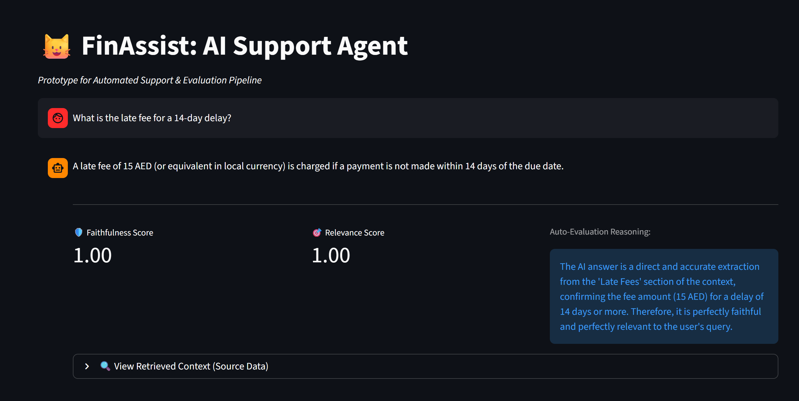

FinAssist: Intelligent RAG Support Agent & Evaluation Pipeline

🚀 Project Overview

FinAssist is an autonomous agent designed for the Fintech domain. It automates responses to complex BNPL (Buy Now, Pay Later) inquiries using a Retrieval-Augmented Generation (RAG) architecture.

Unlike standard chatbots, this project implements a "Senior-Level" Automated Evaluation Pipeline. Every AI response is strictly audited in real-time by a secondary "Judge" LLM to ensure financial compliance and accuracy before it reaches the customer.

🧠 Technical Architecture (Hybrid RAG)

To optimize for both Cost and Performance, this system uses a hybrid approach:

Embeddings (Local): Uses HuggingFace (all-MiniLM-L6-v2) running locally on CPU. This eliminates API rate limits and reduces costs to zero for vector search.

Inference (Cloud): Uses Google Gemini Pro via LangChain for high-quality response generation.

Vector Store: FAISS (Facebook AI Similarity Search) for efficient local similarity search.

✨ Key Features

RAG Pipeline: Retrieves precise policy context (Late fees, Split payments) to ground the LLM's answers.

Automated QA ("LLM-as-a-Judge"): A dedicated pipeline evaluates every interaction on two metrics:

Faithfulness: Is the answer derived only from the retrieved documents? (Prevents Hallucination).

Relevance: Does the answer actually address the user's specific question?

Modular Microservices:

Backend: FastAPI (Python) serving the logic as REST endpoints.

Frontend: Streamlit for a clean, interactive demo UI.

🛠️ Tech Stack

Language: Python 3.10+

Orchestration: LangChain v0.3

API Framework: FastAPI

UI Framework: Streamlit

AI Models: Google Gemini Pro (LLM), HuggingFace (Embeddings)

Vector DB: FAISS

⚙️ Installation & Setup

Clone the Repository

git clone [https://github.com/yourusername/finassist.git](https://github.com/yourusername/finassist.git)
cd finassist

Create Virtual Environment

python -m venv venv
# Windows
venv\Scripts\activate
# Mac/Linux
source venv/bin/activate

Install Dependencies

pip install -r requirements.txt

Set up Environment Variables
Create a .env file in the root directory and add your Google Gemini API Key:

# Get this key from [https://aistudio.google.com/app/apikey](https://aistudio.google.com/app/apikey)
GOOGLE_API_KEY=your_actual_api_key_here

🚀 How to Run

This project follows a Client-Server architecture, so you need two terminal windows.

Terminal 1: Start the Backend (API)

uvicorn app.main:app --reload

Wait until you see: Application startup complete

Terminal 2: Start the Frontend (UI)

streamlit run ui/streamlit_app.py

Ask questions like:
"What is the late fee for a 14-day delay?"

"How long do refunds take?"